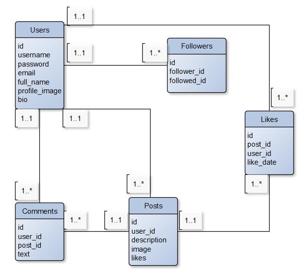

Tema projekta je društvena mreža za umjetnike. 
Baza podataka se sastoji od 5 tablica, i to:
- Users, 
- Followers,
- Likes,
- Posts,
- Comments.

Aplikacija se može vidjeti <a href="http://132.226.216.68:8080/posts">ovdje</a>. Korisnici se mogu registrirati i prijaviti, vidjeti objave od strane drugih umjetnika, dodati svoju objavu te urediti i brisati samo svoje objave. Također, mogu vidjeti svoje korisničke podatke i svoje objave na "moj profil" te se odjaviti.

Izgled relacijskog modela baze podataka:

